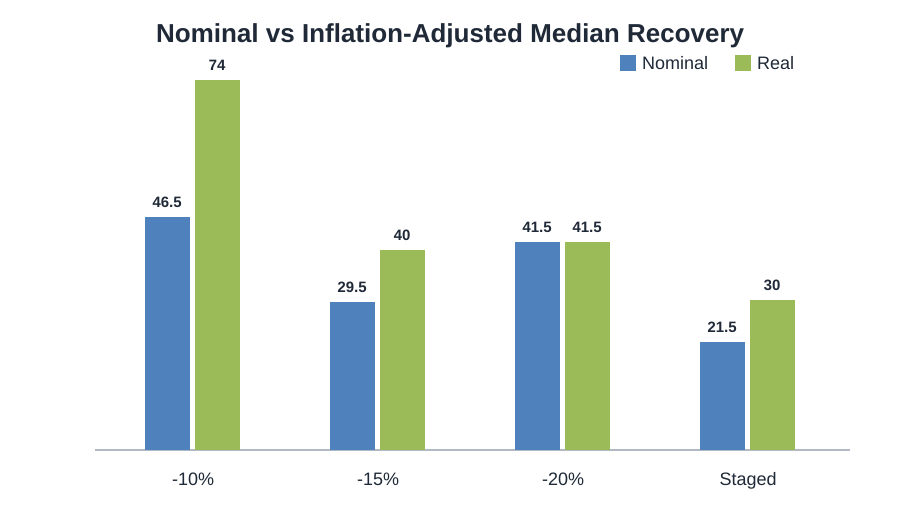
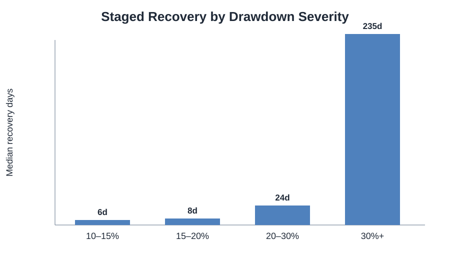
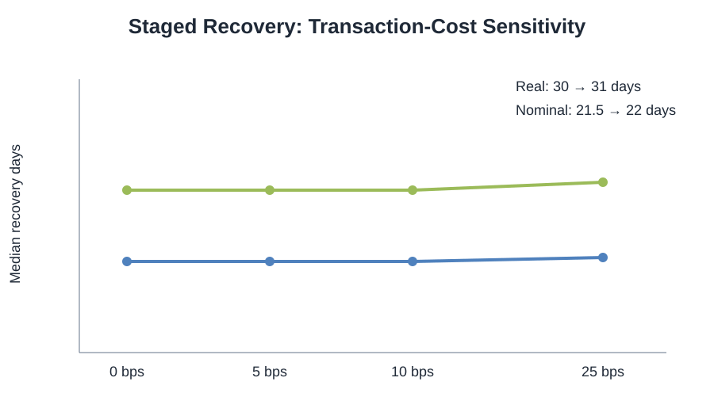

# Event-Driven Drawdowns and Recovery Dynamics in Borsa Istanbul

A reproducible quantitative study of BIST 100 drawdowns, observable dip-entry rules, recovery time, inflation-adjusted breakeven, and transaction-cost sensitivity.

The project started from a simple question:

> If an investor does **not** catch the exact bottom, but accumulates during a sharp selloff, how long has it historically taken to recover?

The first descriptive benchmark was the midpoint of a realized peak-to-trough move,

\[
M_{50}=\frac{X+Y}{2},
\]

where \(X\) is the pre-drawdown peak and \(Y\) is the realized trough. Because \(Y\) is only known in hindsight, the final backtest replaces this with **observable** entry rules at -10%, -15%, and -20% from the prior peak, plus a staged allocation rule.

---

## Key results

The mechanical census covers **7,794 BIST 100 trading-day observations from 21 March 1995 to 22 May 2026** and detects **36 completed drawdown episodes** with a close-based maximum drawdown of at least 10%, plus one open episode at the end of the price series.

### Observable entry rules

| Entry rule | Trades | Median nominal recovery | Recovery ≤90d | Mean extra close-to-trough drawdown |
|---|---:|---:|---:|---:|
| Buy at -10% | 36 | 46.5 days | 66.7% | -14.6% |
| Buy at -15% | 28 | 29.5 days | 67.9% | -13.5% |
| Buy at -20% | 20 | 37.5 days | 60.0% | -13.5% |
| Staged 25% / 35% / 40% | 36 | **21.5 days** | **75.0%** | **-10.8%** |

The staged rule allocates:
- 25% at -10%
- 35% at -15%
- 40% at -20%

Untriggered capital remains uninvested.



### Drawdown severity matters more than a single pooled average

| Maximum drawdown | Episodes | Median staged recovery |
|---|---:|---:|
| 10–15% | 11 | **6 days** |
| 15–20% | 9 | **8 days** |
| 20–30% | 7 | **24 days** |
| 30%+ | 9 | **235 days** |



This is the central result of the study: ordinary 10–20% corrections and 30%+ structural bear markets behave very differently. Pooling them into one “average crisis recovery time” hides the main risk.

---

## Inflation-adjusted recovery

Nominal breakeven is not the same as recovering purchasing power in a high-inflation economy.

Using a Turkey CPI/HICP series and a base transaction-cost assumption of **10 bps per side**:

| Entry rule | Nominal median | Real median |
|---|---:|---:|
| -10% | 46.5 days | **74 days** |
| -15% | 29.5 days | **40 days** |
| -20% | 41.5 days | **41.5 days** |
| Staged | 21.5 days | **30 days** |

For the staged rule, each filled tranche is deflated from its own entry month. Idle cash is excluded from the real-breakeven comparison so the study does not impose an arbitrary assumption about deposit interest on uninvested capital.

---

## Transaction-cost sensitivity

The model tests symmetric per-side cost assumptions of:

- 0 bps
- 5 bps
- 10 bps
- 25 bps

Within this range, transaction costs have a small effect on the **calendar date of breakeven** relative to the effect of inflation.

For the staged rule:
- nominal median recovery: **21.5 → 22 days**
- real median recovery: **30 → 31 days**

as per-side cost increases from 0 to 25 bps.



This does **not** imply that costs are unimportant for strategy returns; it only means they rarely move the historical breakeven date by much in this specific recovery-time framework.

---

## Methodology

### 1. Mechanical drawdown detection

The study does not begin by selecting famous crises.

A drawdown episode is detected from price data first:

1. identify the current high-water-mark close;
2. record the minimum close before that peak is recovered;
3. record the first later close that regains the peak;
4. keep the episode if the maximum close-based drawdown is at least 10%.

This reduces selection bias relative to choosing only memorable political or financial events.

### 2. Observable entries

For an episode with peak close \(X\):

\[
P_{10}=0.90X,\qquad
P_{15}=0.85X,\qquad
P_{20}=0.80X.
\]

A limit is treated as filled if the daily low touches the level.

### 3. Conservative recovery

The primary recovery measure is not the first temporary bounce.

Recovery is the **first close at or above the entry price on or after the final trough of that drawdown episode**.

This avoids counting a one-day rebound that is followed by a deeper low as a completed recovery.

### 4. Staged average cost

If weights \(w_i\) are deployed at prices \(P_i\), the weighted unit cost is

\[
P_{\text{avg}}
=
\frac{\sum_i w_i}
{\sum_i w_i/P_i}.
\]

Only triggered tranches are included.

### 5. Real breakeven

For a single entry, purchasing-power breakeven requires the inflation-adjusted liquidation value to equal or exceed the inflation-adjusted entry outflow.

For staged purchases, every tranche is deflated from its own fill month.

---

## Paired staged-vs.-10% result

On the same 36 completed episodes:

- staged recovered sooner in **28**
- tied in **8**
- recovered slower in **0**

Among the 28 non-tied pairs, an exact sign test gives a two-sided p-value of approximately:

\[
7.45\times10^{-9}.
\]

This is evidence that the staged construction systematically lowers the recovery threshold relative to a full -10% entry **within this historical setup**.

It is **not** proof that the staged rule has higher investment returns, because:
- it often deploys less capital;
- idle-cash returns are not modeled;
- the strategy is evaluated on recovery time rather than risk-adjusted total return.

---

## Data

### BIST 100 daily OHLC

Convenience public mirrors used for reproducibility:

- older daily OHLC series  
  `https://raw.githubusercontent.com/tuannasuhra/ec581/main/XU100.csv`
- newer daily OHLC series through 22 May 2026  
  `https://raw.githubusercontent.com/Ilkin22/BIST-Kriz-Analizi/main/Raw_Data_BIST%20100%20Historical%20Data.csv`

For publication-grade replication, an official Borsa İstanbul DataStore export is preferable.

### Inflation

Turkey CPI series:
- OECD/FRED historical CPI
- extended from May 2025 using Eurostat HICP month-over-month changes

Reference series:
`https://fred.stlouisfed.org/series/CP0000TRM086NEST`

### Dividends

Borsa İstanbul publishes an official **BIST 100 RETURN** index (`XU100_CFNNTLTL`).

A complete reproducible daily total-return history was not present in the current inputs, so the historical backtest remains price-index based rather than splicing incomplete total-return sources.

Ignoring reinvested dividends is expected to make long recovery periods look somewhat slower than a true total-return investor experience.

---

## Repository structure

```text
.
├── README.md
├── requirements.txt
├── src/
│   └── bist_drawdown_census.py
├── data/
│   └── event_windows.csv
├── results/
│   ├── BIST_Drawdown_Census_1995_2026.csv
├── figures/
│   ├── nominal_vs_real.svg
│   ├── severity_vs_recovery.svg
│   └── cost_sensitivity.svg
└── docs/
    ├── METHODOLOGY.md
    ├── CV_BULLETS.md
    └── LINKEDIN_POST.md
```

---

## Run the census

```bash
python -m venv .venv

# Windows
.venv\Scripts\activate

# macOS/Linux
# source .venv/bin/activate

pip install -r requirements.txt

python src/bist_drawdown_census.py \
  --events data/event_windows.csv \
  --out results
```

The script can also accept a local post-May-2026 supplement file.

---

## Limitations

- BIST 100 **price** index, not total-return index.
- No taxes.
- Transaction costs are modeled as simple symmetric per-side assumptions.
- Daily lows determine limit fills; intraday path and order-book liquidity are not modeled.
- Close-based trough risk can understate intraday adverse excursion.
- CPI is monthly while equity prices are daily.
- The analysis describes historical outcomes and does not imply guaranteed future recovery.
- Structural crises and ordinary corrections are economically different regimes; pooled averages should be interpreted carefully.

---

## Research conclusion

The study does not support the statement that buying a crash “guarantees profit.”

It does support a more specific historical observation:

> In BIST 100 drawdowns of 10–30%, staged accumulation generally reduced the time required to regain the invested cost basis relative to a full -10% entry. Once drawdowns exceeded 30%, recovery behavior changed dramatically and long, deep losses became the dominant risk.

The distinction between **correction** and **structural crisis** is more important than any single average recovery statistic.

---

## Disclaimer

This repository is quantitative research and historical analysis only. It is not investment advice and does not provide a forecast of future market outcomes.
